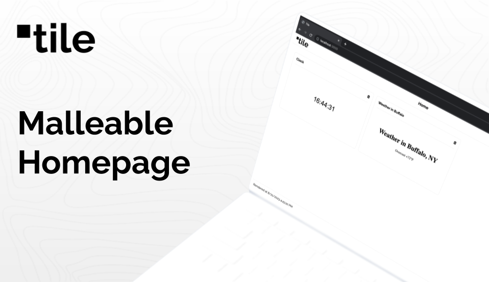
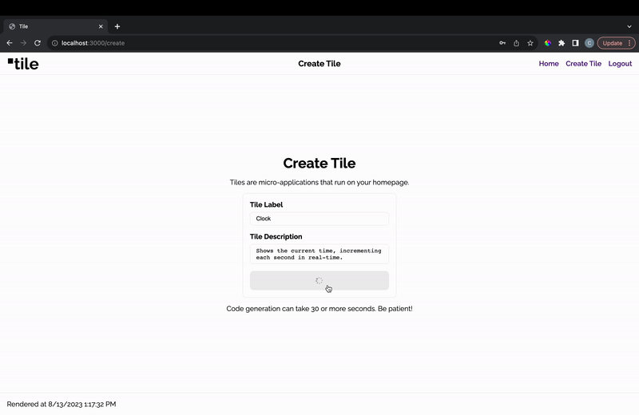

# tile


> Monorepo containing all source code for tile. Hacked in ~3 days for CS-386 @ USF.

# Table of Contents

* [Introduction](#introduction)
    * [Demo](#demo)
    * [Project Requirements](#project-requirements)
    * [Quick Start](#quick-start)
* [License](#license)

# Introduction

tile is a malleable homepage for web browsers. Through a natural language interface, users can specify the content, style, and functionality of small page segments (“tiles”). Natural language instructions are translated into browser-executable code via GPT-4.

## Demo



## Project Requirements

This repository contains the tile `client` and `server`, each with their own system-level requirements. MacOS/VSCode is the preferred development environment.

### client

1. [NodeJS](https://nodejs.org/en/): `brew install node`
2. [NPM](https://www.npmjs.com/): Included with Node installation

### server
1. [NodeJS](https://nodejs.org/en/): `brew install node`
2. [NPM](https://www.npmjs.com/): Included with Node installation

Create a `.env` file with the following configuration:
```
    OPENAI_SECRET=<YOUR_SECRET_KEY>
    MONGO_CONNECTION_STRING=<YOUR_DB_CONNECTION>
```

## Quick Start

To experience the magic of tile locally, the `client` and `server` must run simultaneously. Ensure all system dependencies listed under [project requirements](#project-requirements) are installed before getting started.

_Start the server:_
1. `cd server`
2. `npm install`
3. `npm run start:dev`
4. API will run on `localhost:3000`

_Start the client:_
1. `cd client`
2. `npm install`
3. `npm run start:dev`
4. Navigate to `localhost:8080`

# License

This project is **UNLICENSED**. Unauthorized distribution, use, or modification of this project is strictly forbidden.